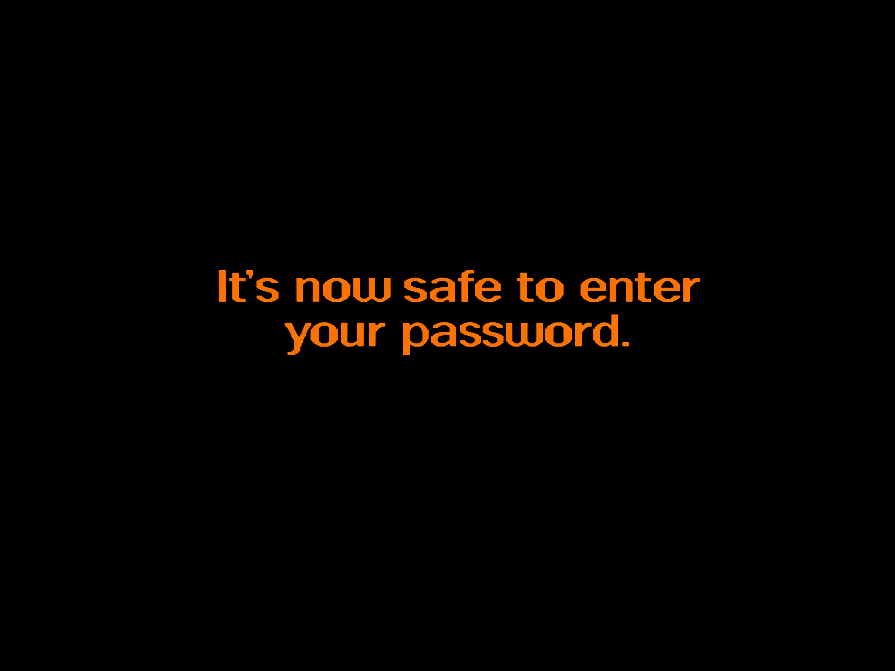

# Win98SE-inspired Plymouth theme for NixOS

I made this Plymouth theme to give NixOS a Windows 98 SE-style boot screen.
It includes custom artwork, a wraparound loading strip, and a matching
password prompt.


The artwork stays at 4:3 on every display. The theme adds black bars when the
display uses a different aspect ratio.

## Password prompt



Each entered character adds one orange dot below the text. Plymouth handles
the password input.

## Install

Add the repository to your flake inputs:

```nix
inputs.win98se-plymouth.url =
  "github:nilp0inter/plymouth-theme-win98se-inspired-nixos-theme";
```

Import the NixOS module:

```nix
modules = [
  inputs.win98se-plymouth.nixosModules.default
  ./configuration.nix
];
```

Rebuild the system:

```console
sudo nixos-rebuild switch --flake .#HOSTNAME
```

## Local checkout

Use an absolute `path:` URL:

```nix
inputs.win98se-plymouth.url =
  "path:/home/user/src/plymouth-theme-win98se-inspired-nixos-theme";
```

## Build

```console
nix build path:.#default
nix flake check path:.
```
