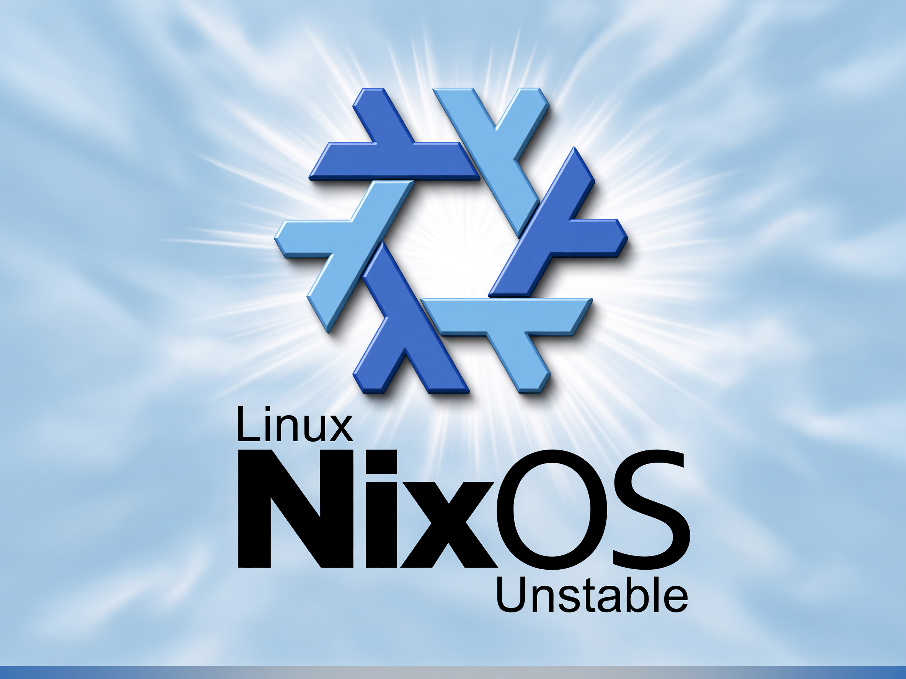

# Win98SE-inspired Plymouth theme for NixOS

I made this Plymouth theme to give NixOS a Windows 98 SE-style boot screen.
It includes custom artwork, a wraparound loading strip, and a matching
password prompt.



The artwork stays at 4:3 on every display. The theme adds black bars when the
display uses a different aspect ratio.

The module uses `boot-26-05.png` on NixOS 26.05. Other releases use
`boot-unstable.png`.

## Password prompt


Each entered character adds one orange dot below the text. Plymouth handles
the password input.

## Install

Add the repository to your flake inputs:

```nix
inputs.win98se-plymouth.url =
  "github:nilp0inter/plymouth-theme-win98se-inspired-nixos-theme";
```

Import the NixOS module:

```nix
modules = [
  inputs.win98se-plymouth.nixosModules.default
  ./configuration.nix
];
```

Rebuild the system:

```console
sudo nixos-rebuild switch --flake .#HOSTNAME
```

## Local checkout

Use an absolute `path:` URL:

```nix
inputs.win98se-plymouth.url =
  "path:/home/user/src/plymouth-theme-win98se-inspired-nixos-theme";
```

## Add artwork for a stable release

### Generate the image

1. Open the [Grok Imagine Image 2.0 playground](https://openrouter.ai/x-ai/grok-imagine-image-2.0#playground).
2. Upload `theme/boot-unstable.png` as the **Image Reference**.
3. Set **Resolution** to **2K**.
4. Set **Aspect Ratio** to **4:3**.
5. Set **Quality** to **Medium**.

Use this prompt:

```text
Change the text "Unstable" by "26.05". Do not change anything else.
```

For another release, replace `26.05` with its version. Keep the rest of the
prompt unchanged.

### Submit the image

1. Save the generated image as `theme/boot-26-05.png`.
2. If the release differs, replace `26-05` and use hyphens instead of dots.
3. Open a pull request that adds the new artwork.

## Build

```console
nix build path:.#default
nix flake check path:.
```
